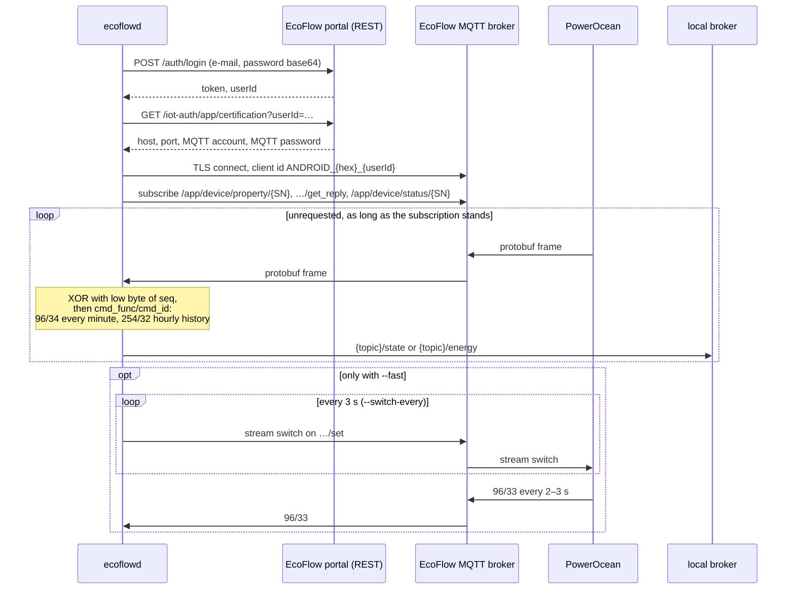

# EcoFlow PowerOcean DC Fit – MQTT bridge, Modbus CLI & notes

`ecoflowd` reads live data from an EcoFlow PowerOcean (DC Fit) through the app's cloud
channel and publishes it to a local MQTT broker – for evcc, Home Assistant or anything
else that speaks MQTT. Alongside: `modbusread`, a read-only Modbus TCP/RTU CLI, and
research notes on the cloud API and the local Modbus registers.

> **Disclaimer:** These notes are mostly based on community reverse engineering, not on
> official EcoFlow documentation. EcoFlow does not officially support or confirm the
> Modbus registers described here. Use at your own risk, especially when writing to
> registers.

## Contents

| File                                                 | Description                                                                                            |
|------------------------------------------------------|--------------------------------------------------------------------------------------------------------|
| [`api-status.md`](./api-status.md)                   | Overview: cloud REST API vs. local Modbus TCP, known problems (e.g. error 1006), unlocking              |
| [`modbus-registers.md`](./modbus-registers.md)       | Register map (SOC, battery, PV, grid, energy counters, control registers) with decoding examples          |
| [`mqtt-output.md`](./mqtt-output.md)                 | The output format of `ecoflowd` on the local broker – why two JSON telegrams and what they look like   |
| [`cmd/modbusread`](./cmd/modbusread)                 | Small Go CLI for checking the registers on the device (see below)                                      |
| [`scripts/ecoflow-api.sh`](./scripts/ecoflow-api.sh) | Shell script for all four cloud paths: Developer API, portal, app MQTT, stream switch (see below)       |
| [`scripts/ecoflow-frames.py`](./scripts/ecoflow-frames.py) | Unpacks the live frames from `ecoflow-api.sh live` – current readings and hourly balance (see below) |
| [`cmd/ecoflowd`](./cmd/ecoflowd)                     | Go service that reads the same channel continuously and publishes to an MQTT broker (see below)         |

## `modbusread`

A universal, **read-only** Modbus reader – address, register and type in, value out. No
EcoFlow knowledge in the tool, no built-in register map; so it is just as useful for any
other Modbus device. Meant for checking the community-derived registers from
`modbus-registers.md` against your own device.

```
go build ./cmd/modbusread

modbusread <target> <address> <type> [flags]
```

Address in decimal (`42082`) or hex (`0xA462`), type `raw`, `uint16`, `int16`, `uint32`,
`int32`, `float32`, `float64` or `string`.

The **target** decides the transport, without an extra flag:

| Input                                             | Transport                            |
|---------------------------------------------------|--------------------------------------|
| `192.168.1.50`, `plc.local:1502`                  | Modbus TCP (port defaults to 502)    |
| `/dev/ttyUSB0`, `/dev/tty.usbserial-…`, `COM3`    | Modbus RTU over the serial line      |
| `rtu://…`, `tcp://…`, `udp://…`, `rtuovertcp://…`, `rtuoverudp://…` | explicit, overrides the detection |

`tcp+tls://` is rejected outright rather than silently ignored – the library could do
it, but offering it untested would be a promise with nothing behind it.

```console
$ modbusread 192.168.1.50 42082 uint16
addr     raw                  value
42082    0x0064               100

# Total PV power: float with swapped words (EcoFlow convention)
$ modbusread 192.168.1.50 40574 float32 --word-order low

# Dump a range to find unknown registers
$ modbusread 192.168.1.50 40520 raw --count 120 --out hex

# Find out which register reacts to a change in the app
$ modbusread 192.168.1.50 40520 raw --count 120 --interval 1s --on-change
```

Important: **addresses are never converted** – they go on the wire exactly as typed
(0-based). Whether the tables in `modbus-registers.md` are meant 1-based or 0-based is
unresolved; the file itself now doubts its earlier 1-based claim. Converting is
therefore left to the human, so the tool does not hide an assumption.

With a serial target the line parameters come in – `--baud` (19200), `--databits` (8),
`--parity` (none) and `--stopbits`. For the latter, `0` follows the Modbus rule: two stop
bits without parity, one with. They have to match the device exactly, otherwise you get
garbage or nothing at all. A bus typically has several devices on it, so `--unit` is no
longer a formality there:

```console
$ modbusread /dev/ttyUSB0 40069 uint16 --baud 9600 --parity even --unit 3
```

On a TCP target these flags are **rejected** rather than ignored – a baud rate that
silently has no effect sends you off debugging the wiring.

More flags: `--unit`, `--fc holding|input`, `--byte-order`, `--timeout`, `--json`,
`--samples`. `modbusread --help` shows everything.

### Installation

With a Go toolchain, straight from the repo:

```
go install github.com/womat/ecoflow/cmd/modbusread@latest
```

For machines **without Go** – such as the Raspberry Pi next to the system – ready-made
binaries are under [Releases](https://github.com/womat/ecoflow/releases). They are
statically linked (`CGO_ENABLED=0`), so there is nothing to install: unpack and run.

```bash
VERSION=v0.5.0   # or the latest, see the releases page
ARCH=linux-arm64 # see the table below

curl -LO "https://github.com/womat/ecoflow/releases/download/$VERSION/modbusread-$VERSION-$ARCH.tar.gz"
tar -xzf "modbusread-$VERSION-$ARCH.tar.gz"
./modbusread --version
```

| Machine                                         | `ARCH`          |
|-------------------------------------------------|-----------------|
| Raspberry Pi 3/4/5 with 64-bit Raspberry Pi OS  | `linux-arm64`   |
| Raspberry Pi with a 32-bit OS, incl. Zero and Pi 1 | `linux-arm`  |
| ordinary Linux PC/server, NAS                   | `linux-amd64`   |
| Mac with Apple Silicon                          | `darwin-arm64`  |
| Mac with Intel                                  | `darwin-amd64`  |
| Windows                                         | `windows-amd64` |

The 32-bit archive is built with `GOARM=6` and therefore also runs on the older ARMv6
models. The download can be checked against the `checksums.txt` of the same release:

```bash
curl -LO "https://github.com/womat/ecoflow/releases/download/$VERSION/checksums.txt"
sha256sum -c checksums.txt --ignore-missing
```

`modbusread --version` reports the commit and Go version from the build info that Go
stamps in by itself during `go build`; release binaries carry the tag number.

A release is made from a tag `vX.Y.Z` on `main`; the workflow builds all targets and
attaches them, with checksums, to the GitHub release.

## `scripts/ecoflow-api.sh`

The counterpart to `modbusread` for the cloud path: a small shell script that builds the
HMAC signature of the EcoFlow Developer/Open API and prints the answer raw.

**With one exception it only reads.** The exception deserves naming rather than hiding:
`fast` publishes to a `.../set` topic and is thus the only command that can change the
device (see below). `values` and `login` use POST — they are still reads, the endpoints
just want it that way; the script does not know the writing PUT counterpart.

Needs `bash`, `curl` and `openssl`. **`jq` is required for most commands** — only
`devices`, `quota`, `get`, `cert`, `portal`, `portal-get` and `selftest` get by without
it, and there it just prettifies the output. The other nine abort without `jq`.

Credentials come from the environment, never from the repo. **There are two kinds, and
most commands need the second:** the API key pair only works for the Developer API
(`devices`, `quota`, `get`, `values`, `cert`, `mqtt`, `request`) — and that is exactly
the one that refuses the DC Fit its readings. Everything that actually delivers data goes
through the portal token (`login`, `portal`, `status`, `portal-get`, `app-cert`,
`app-mqtt`, `live`, `fast`); that needs **no** key pair.

```bash
export ECOFLOW_ACCESS_KEY='…'   # developer-eu.ecoflow.com → Security
export ECOFLOW_SECRET_KEY='…'
# ECOFLOW_HOST sets the host, default https://api-e.ecoflow.com (EU)

scripts/ecoflow-api.sh devices                    # devices on the account
scripts/ecoflow-api.sh quota <SN>                  # all values of a device
scripts/ecoflow-api.sh -v get /iot-open/sign/device/list   # any GET, with debug output
scripts/ecoflow-api.sh values <SN> bpSoc bpPwr     # selected values (POST endpoint)
scripts/ecoflow-api.sh cert                       # MQTT credentials of the account
scripts/ecoflow-api.sh mqtt <SN>                  # subscribe to a topic (Ctrl-C ends)
scripts/ecoflow-api.sh request <SN> bpSoc         # request values over MQTT
export ECOFLOW_PORTAL_TOKEN="$(scripts/ecoflow-api.sh login)"   # get a token by logging in
scripts/ecoflow-api.sh portal <SN>                # consumer portal instead of Developer API
scripts/ecoflow-api.sh status <SN>                # the same data as a short overview
scripts/ecoflow-api.sh portal-get <path>          # any GET against the portal API
scripts/ecoflow-api.sh app-cert                   # MQTT credentials of the app channel
scripts/ecoflow-api.sh live <SN>                  # subscribe to the app channel, keep it alive
scripts/ecoflow-api.sh fast <SN>                  # the same at the fast rate (writes!)
scripts/ecoflow-api.sh app-mqtt <SN>              # listen to what the app sends the device
scripts/ecoflow-api.sh selftest                   # signature and stream switch frame
```

`values` uses `POST /iot-open/sign/device/quota`, the way EcoFlow's PowerOcean docs
describe for selected quantities (`bpSoc`, `bpPwr`, `mpptPwr`, `sysLoadPwr`,
`sysGridPwr`, `pcsAPhase` …). POST is the *read* endpoint here; the script deliberately
does not know the PUT counterpart that sets values.

`mqtt` fetches the credentials via `/iot-open/sign/certification` and subscribes to
`/open/<certificateAccount>/<SN>/quota` (a second argument changes the suffix, e.g.
`status`, `get_reply` or `#`). Every message gets a timestamp – a silent recording is only
evidence if you know when it was silent. Additionally needs `jq` and `mosquitto_sub`
(`brew install mosquitto` or `apt install mosquitto-clients`).

`portal` takes a different path: it queries `provider-service/user/device/detail` – the
endpoint the consumer portal itself uses. It answers even for devices the Developer API
blocks with 1006, and returns SOC, live power, energy counters and the firmware's raw
blocks (69 EMS fields, DCDC status, energy stream). Authentication is not with the API
keys but with the **portal's session token** in `ECOFLOW_PORTAL_TOKEN`. The token
expires; fetch a new one on HTTP 401. Keep it out of the repo and, where possible, out of
the shell history.

### Fetching live values

`status` and `portal` need **no** API key pair – only the portal token. A one-off query
from a fresh shell, login and query in one command:

```console
$ ECOFLOW_PORTAL_TOKEN="$(scripts/ecoflow-api.sh login first.last@example.com)" \
    scripts/ecoflow-api.sh status HC31XXXXXXXXXXXX
Password (not echoed):
logged in as user 1000000000000…
device   : Home (online)
SoC      : 18 %
PV       : 1045 W
grid     : 0 W (idle)
house    : 446 W
battery  : 599 W (charging)

yield    : today 1.90 | month 282.67 | year 4548.79 | total 5236.71 kWh
measured : 2026-09-17T08:39:26Z
```

`measured` is the timestamp from the firmware's energy stream block – the **time of
measurement, not the time of the query**. If it stands still across several calls, the
display is a still image: the endpoint hands out whatever was last pushed to the cloud,
and pushing only happens while a client is asking. That is exactly what `live` is for.

The assignment in front **without `export`** only applies to this one command: afterwards
the shell does not know the variable, the token is in no other process environment, and
there is nothing to clean up – not even after an error or Ctrl-C. The password prompt
comes from the terminal (`/dev/tty`) and therefore also works inside the command
substitution: `login` writes **only** the token to stdout, everything else to stderr.
The e-mail may be left out; it is then asked for or taken from `ECOFLOW_EMAIL`. Needs
`jq` (`brew install jq`).

For several queries without typing the password each time, export the token once – but
**`unset`** it at the end, and with `;` rather than `&&`, otherwise it stays around
precisely when something fails. `export ECOFLOW_PORTAL_TOKEN=` does not delete it; it
sets it empty and leaves it exported:

```bash
export ECOFLOW_PORTAL_TOKEN="$(scripts/ecoflow-api.sh login)"
scripts/ecoflow-api.sh status HC31XXXXXXXXXXXX
scripts/ecoflow-api.sh portal HC31XXXXXXXXXXXX
unset ECOFLOW_PORTAL_TOKEN
```

A subshell takes the token with it when it exits, which saves the cleanup:

```bash
( export ECOFLOW_PORTAL_TOKEN="$(scripts/ecoflow-api.sh login)"
  scripts/ecoflow-api.sh status HC31XXXXXXXXXXXX )
```

The token is valid until it expires; on HTTP 401, log in again.

`status` renders the answer of `portal` as an overview. The portal reports house and
battery power as **negative**, while its own UI shows them as positive. `status` therefore
prints the magnitude and writes the direction next to it, instead of passing on a sign you
would first have to interpret. If you get *"the response carried no data"* instead of the
overview, `ECOFLOW_PRODUCT_TYPE` does not match the device (default `85` = PowerOcean).

Two ways to the token:

- **From the browser:** in the logged-in portal under *Local Storage → `S1_JWT`*.
- **With `login`:** asks for e-mail and password (password without echo, optionally from
  `ECOFLOW_PASSWORD` – better not, an exported variable outlives the shell that set it and
  ends up in process environments).

To weigh it up: `login` uses the consumer app's login endpoint, which sends the password
**base64-encoded, not hashed** – base64 is encoding, not encryption; only the TLS channel
protects it. The browser token is the smaller secret and expires by itself; the password
is the more convenient way. Both are unofficial interfaces.

### Keeping the channel alive: `live`

`status` only returns fresh numbers if the device pushed something to the cloud shortly
before – and apparently it only does that while someone is asking. Without an open app,
`measured` stands still, sometimes for hours. `live` takes over the app's role:

```bash
export ECOFLOW_PORTAL_TOKEN="$(scripts/ecoflow-api.sh login)"
export ECOFLOW_USER_ID=1000000000000000000   # "login" prints this ready to export
scripts/ecoflow-api.sh live HC31XXXXXXXXXXXX
```

It fetches the app MQTT channel's credentials via `app-cert`, subscribes to the device's
three topics and sends a request every `ECOFLOW_LIVE_INTERVAL` seconds (default 30). Runs
until Ctrl-C. Needs `jq`, `mosquitto_sub` and `mosquitto_pub`.

**That request is unnecessary, though** — measured at the device: with
`ECOFLOW_LIVE_INTERVAL=0`, i.e. without any publish at all, minute values kept coming
without a gap for 23 minutes. The subscription alone keeps the device talking. The
default of 30 stays for now, because other models may need it; if you want to work
strictly read-only, set `ECOFLOW_LIVE_INTERVAL=0` — then `live` publishes nothing at all:

```bash
ECOFLOW_LIVE_INTERVAL=0 scripts/ecoflow-api.sh live HC31XXXXXXXXXXXX
```

The output of `live` is **raw** – timestamp, topic, length and payload as hex, because the
push is protobuf, not JSON:

```console
2026-09-22T10:18:05+0200 /app/device/property/HC31... 74 0a480a26f6ddf1e70b98...
```

### Current readings: `ecoflow-frames.py`

For reading there is `scripts/ecoflow-frames.py`, which unpacks the frames. It only needs
`python3`, no further packages:

```console
$ scripts/ecoflow-api.sh live HC31XXXXXXXXXXXX | python3 scripts/ecoflow-frames.py
08:18:00Z  PV     969 W | house    352 W | battery    530 W (charging) | grid     87 W (export) | SoC 60 %
08:19:00Z  PV     976 W | house    349 W | battery    540 W (charging) | grid     87 W (export) | SoC 61 %
```

This is the way to current values – **not** `status`. Measured at the device
(22 September 2026): while `live` was running and frames stamped `08:19Z` were arriving,
`status` kept reporting `measured : 07:13:28Z`. So the detour through the cloud is not
refreshed even by a running listener.

The timestamp on the left is the device's (UTC). The device sends some frames twice;
identical consecutive lines are suppressed, but two different values within the same
second are not — those happen. How the frames are built, why the payload is
XOR-obfuscated and what the field assignment rests on is in `api-status.md`.

### Fast rate: `fast`

Every few seconds instead of every minute – that is what `fast` is for, in place of
`live`. It needs the same two variables as `live`:

```bash
export ECOFLOW_PORTAL_TOKEN="$(scripts/ecoflow-api.sh login)"
export ECOFLOW_USER_ID=1000000000000000000     # "login" prints this ready to export

scripts/ecoflow-api.sh fast HC31XXXXXXXXXXXX | python3 scripts/ecoflow-frames.py
```

It does everything `live` does and additionally switches on the fast data stream.

**This is the only command in the script that writes to a `.../set` topic** – that is, to
the path through which the device could also be reconfigured. That is why it is a command
of its own: the write never happens on the side, only when you type `fast`.

What gets sent is **not guessed**. The command was captured by subscribing to the `set`
topic while operating the phone app (`app-mqtt`, see below); the script replays those
bytes unchanged and only changes the sequence number. It carries no parameters. An earlier
attempt to assemble it from third-party sources was wrong in four places — see
`api-status.md`.

```console
09:13:19Z  PV     970 W | house    415 W | battery    482 W (charging) | grid     72 W (export) | SoC 63 %
09:13:20Z  PV     963 W | house    403 W | battery    476 W (charging) | grid     83 W (export) | SoC 63 %
09:13:22Z  PV     967 W | house    403 W | battery    472 W (charging) | grid     92 W (export) | SoC 63 %
```

Measured: 131 values over a little more than four minutes, on average every 1.9 s —
instead of four. The timestamp here is **accurate to the second**; in the minute report it
is rounded to the minute.

While the fast stream is running, the minute report is **not** shown as well: it carries
the same timestamp as a per-second report that already existed, and with its rounded time
it would look like a standstill. When the fast stream dries up, it appears again.

`ECOFLOW_FAST_INTERVAL` sets the repeat rate, default 3 seconds — the app's rhythm.
**Longer is not more economical, it simply does not work:** at 10 seconds the device fell
back to the minute rate. The switch only lasts a few seconds.

It has a cost: each switch starts its own `mosquitto_pub`, i.e. a new connection every
three seconds. Fine for a measurement, not nice for continuous operation.

### Today's hourly values: `--hours`

On the side, the device sends the **energy balance of the current day, hour by hour**. It
is in the most frequent frame of all, but only arrives in fast mode:

```console
$ scripts/ecoflow-api.sh fast HC31XXXXXXXXXXXX | python3 scripts/ecoflow-frames.py --hours
hourly energy in Wh, device day up to 2026-09-22 09:13:18Z

flow             0     1     2     3     4     5     6     7     8     9   total
PV               0     0     0     0    43   183   738  1350   793   194    3301
battery in       0     0     0     0     0     0   288   798   357   102    1545
battery out    261   245   248   297   353   158     0     0     0     0    1562
grid in          1     0     0    11    32    13     1     1     3     0      62
grid out         0     0     0     0     0     2    68    81    24     0     175
house          262   246   249   308   427   352   383   473   415    91    3206
balance          0    -1    -1     0     1     0     0    -1     0     1
```

It waits for a complete report, prints the table and **then exits** — the data stream
stops along with it. The hours are UTC; the current one is still filling up.

The `balance` row is the check and belongs to the output: in every hour,
`PV + battery out + grid in` must equal `house + battery in + grid out`. If it shows
anything other than a rounding difference, the field assignment no longer holds — for
instance because a firmware shifted the numbers. That is exactly how it was established in
the first place; details in `api-status.md`.

### Which components the system reports: `--modules`

```console
$ scripts/ecoflow-api.sh fast HC31XXXXXXXXXXXX | python3 scripts/ecoflow-frames.py --modules
modules reported by the system

  system     HC31XXXXXXXXXXXX
  converter  HC31YYYYYYYYYYYY
  battery    HJ3AXXXXXXXXXXXX
  battery    HJ3AYYYYYYYYYYYY
```

Serial numbers and configuration without app or portal — here a 5 kW converter with two
battery modules. Like `--hours`, it waits for the first report and then exits.

The labels are **not guessed from the prefixes** but checked against the portal's display:
`user-portal.ecoflow.com` lists the same serial numbers with type and model under
*System information → Component information*. Firmware versions and activation date are
only there, though, not in the frame.

### Listening to what the app sends: `app-mqtt`

```bash
scripts/ecoflow-api.sh app-mqtt HC31XXXXXXXXXXXX        # default topic: set
```

Subscribes to one of the app topics under `/app/<userId>/<SN>/thing/property/` and shows
what arrives there. The default is `set` — the topic the script otherwise writes nothing
to. Operate the phone app while this is running and you see its commands in the original.
Pure subscription, no write access.

**Caveat:** the field numbers apply to the **DC Fit**. On the PowerOcean Plus the same
quantities sit on different numbers – there the script produced plausible numbers under
the wrong names. The assignment here is backed by the energy balance: in every frame,
`PV = battery + house + grid` adds up to two decimal places.

**Why Python and not Go:** this is an intermediate stage for trying things out, not a
commitment. Python 3 is already there on the Mac and the Raspberry Pi, and the protobuf
wrapper can be read with the standard library – for eight fields a protobuf toolchain
costs more than it brings. If the decoding proves itself in everyday use, it belongs in
the repo as a Go tool: then it runs in CI, is testable without a device like
`internal/decode`, and the release binaries cover it too.

**Three commands publish, all others only subscribe.** Two of them to a `get` topic, i.e.
read requests: `request` and `live`. The third, `fast`, publishes to `.../set` — the only
path in the script through which the device could be reconfigured. That it is a command of
its own and not a switch on `live` is intentional: whoever queries values should not be
writing without noticing.

`request` subscribes to **two** topics — `.../get_reply` and `.../quota` —, sends the
request to `.../get` and waits `ECOFLOW_WAIT` seconds (default 15). Listening on both is
not overeagerness: on some accounts the ACL refuses `.../get_reply` while granting
`.../quota`. The suffix is hard-wired; there is no free topic argument. Additionally needs
`mosquitto_pub`.

Four exit codes, not two — if you only check for "non-zero", you mistake a network error
for an API answer:

| Code | Meaning                                                    |
|------|------------------------------------------------------------|
| `0`  | the API answered with `code 0`                             |
| `1`  | usage or configuration error (missing variable …)          |
| `2`  | the API answered with a different code                     |
| `3`  | the request itself failed — network, TLS, name resolution  |

**`2` with code 1006** is the interesting answer: it means the model is excluded from the
Developer API (see `api-status.md`) and only the app MQTT channel or local Modbus remain.
The device has to be bound to your own EcoFlow account, otherwise the list stays empty.

## `ecoflowd`

The counterpart to `modbusread` for continuous operation: a Go service that reads the app
MQTT channel instead of opening it for a single measurement. Meant for a Raspberry Pi
under systemd.

It connects, reconnects after a drop, prints the readings to stdout and passes them on to
a local MQTT broker.

```bash
export ECOFLOW_EMAIL='first.last@example.com'
export ECOFLOW_PASSWORD='…'

go build ./cmd/ecoflowd
./ecoflowd --sn HC31XXXXXXXXXXXX --stdout
```

| Flag | Meaning |
|---|---|
| `--sn` | serial number of the device (required) |
| `--broker` | local MQTT broker, e.g. `tcp://127.0.0.1:1883` |
| `--topic` | prefix on the local broker, default `ecoflow` |
| `--mqtt-user` | user for the local broker; password via `MQTT_PASSWORD` |
| `--stdout` | also write every reading to stdout |
| `--fast` | switch on the fast stream — **writes**, see below |
| `--switch-every` | repeat rate for it, default 3s; below 1s is rejected |
| `--host` | different API host; for US accounts `https://api-a.ecoflow.com` |
| `-v` | report every incoming frame |
| `--version` | print the version and exit |

Credentials come exclusively from the environment — `ECOFLOW_EMAIL`, `ECOFLOW_PASSWORD`,
optionally `ECOFLOW_HOST` and `MQTT_PASSWORD`. Never from flags: whatever is on the
command line, anyone on the machine can read in the process list.

Three exit codes, and one of them matters for continuous operation:

| Code | Meaning |
|---|---|
| `0` | stopped on a signal |
| `1` | usage or configuration error |
| `78` | **the credentials were rejected** — waiting never helps here |

There is no code for "gave up after repeated failure": on network and broker errors the
service never gives up, it keeps trying with a growing pause (see
[How ecoflowd gets its data](#how-ecoflowd-gets-its-data)).

The systemd unit lists `78` in `RestartPreventExitStatus`, so that a typo in the
credentials file does not keep firing login attempts at an unofficial endpoint forever.

What counts as a rejection is deliberately narrow, because `78` stops the service for
good: only an answer the cloud formed itself that carries a `code` other than `0`. A
request without an answer, an answer that is not JSON, and a `429` or `5xx` are **not** —
those are retried like any other failure.

**The known gap:** EcoFlow documents these codes nowhere. A `code` that means something
other than "wrong password" — a locked account, say — would arrive with `HTTP 200` and
still land on `78`. The service prints the cloud's message verbatim; if e-mail and
password are right, a `systemctl start` is the way back.

```console
connected to mqtt-e.ecoflow.com:8883, subscribed to 3 topics
10:29:00Z  PV    1511 W | house    480 W | battery    980 W (charging) | grid     52 W (export) | SoC 73 %
10:30:00Z  PV    1544 W | house    618 W | battery    926 W (charging) | grid      0 W (idle) | SoC 74 %
```

**Without `--fast` it sends nothing to the device.** That is not caution but what the
device needs: the subscription alone keeps it talking, measured over 23 minutes without a
single message sent to the cloud. The readings still go to your local broker — just every
minute instead of every two to three seconds.

### How ecoflowd gets its data

Not through the Developer API — that one refuses the PowerOcean with error 1006, see
[`api-status.md`](api-status.md) —, but the way the app does it: two REST calls to get in,
then an MQTT subscription over which the device delivers on its own.



When something goes wrong, the service tells three cases apart — by whether waiting helps:

- **Connection gone** (network, broker, timeout): it waits and starts over at the
  certification. The wait starts at 5 s and doubles up to at most 15 min; if the
  connection stood in between, it starts at 5 s again. The token is kept, so there is no
  new login. The client id is new on every attempt, because the broker refuses one it has
  already seen — which is also why paho does not reconnect on its own.
- **Token rejected** (`401`/`403` or a `code` other than `0` on the certification): the
  token is discarded, the next attempt starts with a login.
- **Credentials rejected**: exit `78`, see above — no restart by systemd.

On top of that, with `--fast`: if the broker accepts the switch but no fast reports
arrive, the service says so once after about 60 s and carries on at the minute rate.

In the code: the flow in [`cmd/ecoflowd/serve.go`](cmd/ecoflowd/serve.go), login,
certification and topics in [`internal/ecoflow/`](internal/ecoflow/), unpacking the frames
in [`internal/frames/frame.go`](internal/frames/frame.go).

### On the Raspberry Pi

Get the binary from the [releases](https://github.com/womat/ecoflow/releases) — the same
platforms as for `modbusread`, statically linked, nothing to install:

```bash
VERSION=v0.5.0   # or the latest, see the releases page
ARCH=linux-arm64

curl -LO "https://github.com/womat/ecoflow/releases/download/$VERSION/ecoflowd-$VERSION-$ARCH.tar.gz"
tar -xzf "ecoflowd-$VERSION-$ARCH.tar.gz"
sudo install -m 0755 ecoflowd /usr/local/bin/
```

The unit comes as a template — one instance per device, the serial number goes after the
`@`. The release archive only contains the binary, so the unit comes from the repo, from
the same tag as the binary (with a checkout,
`sudo cp contrib/ecoflowd@.service /etc/systemd/system/` does it too):

```bash
sudo curl -fsSL -o /etc/systemd/system/ecoflowd@.service \
  "https://raw.githubusercontent.com/womat/ecoflow/$VERSION/contrib/ecoflowd@.service"
sudo install -d -m 0700 /etc/ecoflowd
sudo install -m 0600 /dev/null /etc/ecoflowd/env
sudo nano /etc/ecoflowd/env
sudo systemctl enable --now ecoflowd@HC31XXXXXXXXXXXX
```

`/etc/ecoflowd/env`:

```ini
ECOFLOW_EMAIL=first.last@example.com
ECOFLOW_PASSWORD=…
MQTT_PASSWORD=…
ECOFLOWD_OPTIONS=--broker tcp://127.0.0.1:1883
```

**This file is the account password**, not an application token — `0700` on the
directory and `0600` on the file are therefore not overdone. The login endpoint sends it
base64-encoded rather than hashed; only the TLS channel protects it.

The unit runs under `DynamicUser` with `ProtectSystem=strict` and writes nothing to disk
— the session token lives in the process's memory.

**The binary belongs in `/usr/local/bin`, not in a directory of its own with tight
permissions** such as `/opt/<name>/bin` with `0770 pv:docker`. The dynamic user is
neither the owner nor in the group, it would not get in, and the start would fail with
"Permission denied". The two obvious ways out are deliberately not taken:

- **Adding the service user to the `docker` group** (`SupplementaryGroups=`) — whoever is
  in `docker` is practically root via the Docker socket.
- **`User=pv` instead of `DynamicUser`** — then the process runs under an account that can
  read its own credentials file. As it is, only systemd reads it as root and passes the
  values to the process as environment; the service user has no access to
  `/etc/ecoflowd`.

`RestartPreventExitStatus=78` is the core: when the credentials are rejected, the service
stays down instead of firing a typo at an unofficial endpoint every hour — for the narrow
meaning of "rejected", see the exit code table above. Any *other* failure restarts after
30 seconds — a clean stop by signal does not, because the unit is set to
`Restart=on-failure`.

```bash
systemctl status ecoflowd@HC31XXXXXXXXXXXX
journalctl -fu ecoflowd@HC31XXXXXXXXXXXX
```

### To the local broker: `--broker`

```bash
./ecoflowd --sn HC31XXXXXXXXXXXX --broker tcp://127.0.0.1:1883 --topic myhome/ecoflow
```

**Two JSON telegrams**, neither retained, QoS 0. The topic is `--topic` (default
`ecoflow`) plus a fixed `/state` or `/energy`:

```
myhome/ecoflow/state   {"sn":"HC31XXXXXXXXXXXX","timestamp":"2026-09-22T09:13:16Z","pv":975,"house":-459,"battery":515,"grid":0,"soc":63}
myhome/ecoflow/energy  {"sn":"HC31XXXXXXXXXXXX","timestamp":"2026-09-22T09:13:18Z","pv":3301,"house":3206,"batteryIn":1545,"batteryOut":1562,"gridIn":62,"gridOut":175}
```

The values are decoded from the capture `internal/frames/testdata/fast.txt`.

**`state`** – one telegram per new measurement, every minute without `--fast`, every two
to three seconds with `--fast`:

| Key         | Unit          | Meaning                                           |
|-------------|---------------|---------------------------------------------------|
| `sn`        | –             | serial number of the device                       |
| `timestamp` | RFC 3339, UTC | **the device's time of measurement**, not the send time |
| `pv`        | W             | PV power                                          |
| `house`     | W             | house load, **negative = consumption**            |
| `battery`   | W             | **positive = charging**, negative = discharging   |
| `grid`      | W             | **positive = export**, negative = import          |
| `soc`       | %             | state of charge                                   |

**`energy`** – the day's totals, as soon as the six parts of the hourly history with the
same timestamp are together (without `--fast` roughly every ten minutes):

| Key                          | Unit    | Meaning                                       |
|------------------------------|---------|-----------------------------------------------|
| `sn`, `timestamp`            | –       | as above; `timestamp` of the hourly history   |
| `pv`, `house`                | Wh      | PV yield, house consumption                   |
| `batteryIn`, `batteryOut`    | Wh      | charged, discharged                           |
| `gridIn`, `gridOut`          | Wh      | import, export                                |

**"Today" is the UTC day**, because the device keeps its hours in UTC. In Austria the
totals therefore jump to 0 at 01:00 (CET) or 02:00 (CEST), not at midnight.

**Why the timestamp is in the telegram.** It makes three mechanisms unnecessary that the
earlier format needed: the heartbeat, the availability topic with last will, and the
staleness watchdog behind it. A receiver sees the age of every value itself, and by the
**device's** clock. A hanging service can only be noticed by the receiver anyway – a hung
process reports nothing, least of all that it is hung. That is why every consumer needs an
age check: `timeout` in evcc, `expire_after` in Home Assistant.

**Why `grid` is 0 rather than missing.** The device simply leaves a field with the value 0
out of the frame – that is how protobuf (proto3) works: a field with its default value is
not transmitted, and the receiver reads the absence as 0. `grid` is missing like this in
about half of all reports, and in every one of them the energy balance adds up exactly
with `grid = 0`. "Missing" here therefore means "measured 0"; if it were left out, `grid`
would be missing in precisely the most common state. That EcoFlow uses proto3 is inferred
from this behaviour, not proven. The numbers are in [`mqtt-output.md`](./mqtt-output.md).

**`dcdc` is deliberately not published** as long as its role is not clear (see
"Open points"). Both decoders still read the field, but it is output nowhere; a capture
from `ecoflow-api.sh live|fast` serves to clear it up.

**The serial number is in the telegram, not in the topic.** There it survives forwarding
to InfluxDB or into a queue where the topic gets lost, and `--topic` fits into any
existing naming scheme. Several devices each need their own `--topic`. **Best keep topics
lowercase:** MQTT is case-sensitive, and a subscription with one wrong letter gets no
error message, but nothing. `ecoflowd` takes `--topic` unchanged.

**Keys in camelCase.** JSON itself prescribes no style; camelCase is the one of the common
guidelines (Google, Microsoft, JSON:API). Reasoning in `mqtt-output.md`.

**Nothing is retained.** A retained reading outlives what it describes, and Home Assistant
warns that retained values clash with `expire_after`. Whoever reconnects waits for the
next measurement – without `--fast` at most a minute.

With `--mqtt-user` and `MQTT_PASSWORD` for a broker that requires authentication. The
password comes from the environment, because a flag would show up in the process list.

**Moving from v0.4.x.** Up to v0.4.x, `ecoflowd` published one topic per value
(`ecoflow/<SN>/pv`, …, `/energy/…`) and a retained `ecoflow/<SN>/status`. All of that is
gone without replacement as of v0.5.0. The old retained `status` stays on the broker until
you delete it:

```bash
mosquitto_pub -h <broker> -r -n -t ecoflow/HC31XXXXXXXXXXXX/status
```

#### evcc

The signs stay as the device measures them — converting is left to the human, the same
rule as for the addresses in `modbusread`. evcc expects the opposite and has `scale` for
it; `jq` pulls the value out of the telegram:

```yaml
meters:
  - name: pv
    type: custom
    power:
      source: mqtt
      topic: ecoflow/state
      jq: .pv
      timeout: 180s          # without timeout every value counts as current forever
  - name: grid
    type: custom
    power:
      source: mqtt
      topic: ecoflow/state
      jq: .grid
      scale: -1              # device: positive = export, evcc: positive = import
      timeout: 180s
  - name: battery
    type: custom
    power:
      source: mqtt
      topic: ecoflow/state
      jq: .battery
      scale: -1              # device: positive = charging, evcc: positive = discharging
      timeout: 180s
    soc:
      source: mqtt
      topic: ecoflow/state
      jq: .soc
      timeout: 180s
```

`timeout` is not optional: without it, evcc by its own documentation accepts "values of
any age" — a frozen value would then silently keep being used.

For energy values from `ecoflow/energy`, add `scale: 0.001`, because evcc expects kWh and
the values here are Wh.

#### Home Assistant

```yaml
mqtt:
  sensor:
    - name: "PV"
      state_topic: "ecoflow/state"
      value_template: "{{ value_json.pv }}"
      unit_of_measurement: "W"
      device_class: power
      state_class: measurement
      expire_after: 180
```

`expire_after` replaces the earlier `availability_topic`: if no telegram comes for three
minutes, the sensor becomes `unavailable`.

### Per-second values: `--fast`

```bash
./ecoflowd --sn HC31XXXXXXXXXXXX --stdout --fast
```

Sends the stream switch every `--switch-every` seconds (default 3) and delivers values
every two to three seconds instead of every minute.

**This is the program's only write path**, and it goes to the `.../set` topic — the path
through which the device could also be reconfigured. That is why it is a flag and not a
default: whoever queries values never writes without noticing.

The command itself is not guessed. It was captured on the wire while the phone app was
running; the program replays those bytes unchanged and only changes the sequence number.
It carries no parameters. A repeat interval of ten seconds was measured to be too slow —
the device then falls back to the minute rate —, hence three, the app's rate.

If the fast stream still does not come, the service says so **once** and carries on at the
minute rate. The broker accepts the switch in any case (`PUBACK RC:0` measured); whether
it works is shown only by whether fast reports arrive.

**Credentials come from the environment, never from flags.** The login endpoint sends the
password base64-encoded rather than hashed, and it is the **account password**, not an
application token — whoever can read the file has full EcoFlow access. On a long-running
machine it belongs in a file only root can read.

The session token stays in memory as long as the process runs — and it runs until a
signal comes or the credentials are rejected. A network that comes and goes is handled
internally and does **not** lead to a new login: the token is only thrown away when the
cloud itself rejects it (HTTP 401/403 or a `code` other than `0` on `certification`) — a
dropped connection, a timeout or an HTML error page from the gateway say nothing about
the token. The difference is not cosmetic: the login is the one request that carries the
account password, and before this a flaky line triggered it on every attempt. The token is
not written to disk: that would save exactly one login per restart and be one more copy of
an access credential on a file system.

The output is **character-for-character identical** to `scripts/ecoflow-frames.py` — not
out of taste, but so that both versions can be run side by side and compared; a test holds
them together against the same captures.

## Summary

- A specific, officially documented REST API for the DC Fit does not exist.
- Four paths were examined; **exactly one delivers readings continuously today**, and that
  is the unofficial MQTT channel of the consumer app.
- The generic EcoFlow Developer/Open API (cloud) returns error 1006 "not allowed" for the
  PowerOcean family – a model blocklist, not a bug. The **DC Fit (SN prefix `HC31`) is
  affected, confirmed on the device**: `device/list` does list it with code 0, but
  `device/quota/all` refuses the readings with 1006.
- The **consumer portal** (REST, session token) answers, but only hands out the state last
  pushed to the cloud – in one measurement it stood still for over an hour.
- The **app's MQTT channel** (protobuf, reverse-engineered) delivers minute values on its
  own and per-second values with the stream switch. `scripts/ecoflow-api.sh` and the
  service `cmd/ecoflowd` run on it.
- **Local Modbus TCP** (port 502) would be the stable path, but is still locked on the
  device (`connection refused`): it has to be unlocked by the installer via the EcoFlow
  Pro app, and the register layout is not officially documented but community-derived.
- For details see the linked files, and the comparison in `api-status.md`.

## Open points

- Confirmation of the register mapping on the DC Fit. The current source treats it as the
  normal case and knows only *one* model-dependent special case, and that one concerns the
  Plus
- Which of the two register readings is right: `modbus-registers.md` puts the
  contradictory addresses of both sources side by side, every row is a single test on the
  device (e.g. system SOC at 40527 vs. 42082)
- Confirmation on the device that unlocking really goes through *Control Mode →
  "Modbus control"* in the Pro app (checklist in `api-status.md`)
- Which values `product_category`/`product_number` (40002/40003) return on the DC Fit –
  the reference integration does not know them
- Whether the fast stream ends after the last switch for reasons of time or because the
  MQTT connection dropped. **About 25 seconds** of run-on were measured; but the same
  measurement also reconnected, so it does not separate the two
- The remaining fields of `cmd_id` 110. A night with PV = 0 split them into three groups
  (PV-bound, battery discharge, settings) and established fields 45/47 as discharge power;
  still unclear are, among others, 2, 3, 5, 18, 19, 24, 28, 32 and 48. `cmd_id` 1, 108,
  109, 111 and 136 are decoded
- Whether energy reports **arrive at all at night** on the DC Fit. The device leaves out
  fields with the value 0 (see "Why `grid` is 0" above); with PV = 0 the PV field was then
  missing too, and both decoders discard a frame without PV
  (`internal/frames/energy.go`, `scripts/ecoflow-frames.py`). The captures in the repo are
  daytime recordings only (PV ≥ 948 W) and do not settle it. To be checked with a
  night-time `ecoflow-api.sh live`
- What `dcdc` (field 2 of the energy report) measures. The name comes from a third-party
  source (`dcdc_pwr`); it is **not** part of the energy balance and follows the battery
  with the same sign, in the captures at 63–103 % of its value, without a fixed ratio.
  Until that is clear, `ecoflowd` does not publish it
- Why the portal's daily yield is off in both directions **during the day**. After sunset
  portal and device agree to within 0.058 %, so they measure the same thing; the portal
  just updates in jumps. In practice: take daily values from the device, not from the
  portal

## Working on this repo

Every change – Go code and notes alike – goes through a short-lived feature branch and a
PR to `main`. That keeps `main` shippable at all times, and CI checks *before* something
lands, not after. This matters because a release is a tag on `main` (see below).

**1. Start clean.** You branch off `main` right away; if your copy is old, you build on
something outdated and buy yourself conflicts at merge time.

```bash
git checkout main && git pull
```

**2. Create a branch.** Short, lowercase, named after the *goal* of the change.

```bash
git checkout -b register-map-dcfit
```

**3. Change and check locally.** These are exactly the checks from
`.github/workflows/ci.yml` – if they pass here, CI will hardly go red later.

```bash
go build ./... && go vet ./... && go test ./...
gofmt -l ./cmd ./internal      # no output = fine
```

For documentation-only changes this does not apply. Instead: `README.md`,
`api-status.md` and `modbus-registers.md` overlap on purpose – if a statement changes,
carry the other places and the "open points" lists along.

**4. Commit.** Subject line in the imperative, naming the *result*; below it a paragraph
on the **why**. The what is already in the diff. `git add -p` shows every hunk
separately, so no forgotten debug statement slips in.

```bash
git add -p && git commit
```

**5. Push and open a PR.** `--fill` takes title and body from the commit.

```bash
git push -u origin register-map-dcfit
gh pr create --base main --fill
```

**6. Wait for CI.** It runs on a fresh machine and thus finds the forgotten file and the
dependency that only exists locally. Red means: fix, commit again, push – the PR updates
by itself.

```bash
gh pr checks --watch
```

**7. Merge.** Squash turns the intermediate steps into one readable commit on `main`.
GitHub deletes the remote branch by itself.

```bash
gh pr merge --squash --delete-branch
git checkout main && git pull
```

**Go version and dependencies.** The `go` line in `go.mod` is a *minimum version* and
therefore names only the minor version (`go 1.27`), no patch. A patch there would force
everyone with an older patch version to download a toolchain, although the code needs
nothing from it. Security fixes to the standard library come from the toolchain used to
build, and CI and release both build with `stable`. The line is only raised when the code
needs a newer language or library feature. `go list -m -u all` checks the dependencies;
`govulncheck ./...` shows whether a known vulnerability reaches your own code. Whatever
sits only in an included module is updated too.

**Release.** When the state on `main` is to be published:

```bash
git checkout main && git pull
git tag vX.Y.Z && git push origin vX.Y.Z
```

**Which number** is decided by the *kind* of change, not its size: patch, as long as
nothing about the behaviour changes — and help texts, comments and docs do not change it,
even if the diff is large. Minor, as soon as a flag, a command or a topic is added – and
likewise, as long as the number starts with `0.`, when one is removed or an output format
changes. That is then a break and is stated as such in the release notes; that is what
happened with `v0.5.0`, when the single topics gave way to the JSON telegrams. This is
easy to mix up: `v0.4.1` comprised about 60 corrections across nine files and was still a
patch, because not a single code path ran differently.

Only tag on `main` – `release.yml` builds the binaries from it and stamps the version
number in via `-X main.version`. A tag on another branch would produce a release pointing
at a state that never existed in `main`.

> A squash merge creates a *new* commit on `main`; the branch's commit never becomes an
> ancestor of `main`. `git branch --merged` therefore reports such branches as "not
> merged" forever – `gh pr list` is the reliable way.

## Sources

- https://developer.ecoflow.com
- https://github.com/Feberdin/ecoflow-powerocean-ha
- https://github.com/MaxGrmm/ecoflow-poweroceanplus-modbus
- https://github.com/MaxGrmm/EF-PowerOcean-TcpModbus
- https://github.com/windmark/EF-PowerOcean-TcpModbus
- https://docs.evcc.io/en/meters/ecoflow-powerocean-modbus
- https://github.com/shuette42/ecoflow-energy-ha
- https://www.photovoltaikforum.com/thread/247994-ecoflow-powerocean-modbus-protokoll/

## License

MIT – see [`LICENSE`](./LICENSE). Note that parts of the register information were taken
from MIT-licensed third-party sources (see above); the respective original links are given
in `modbus-registers.md`.
