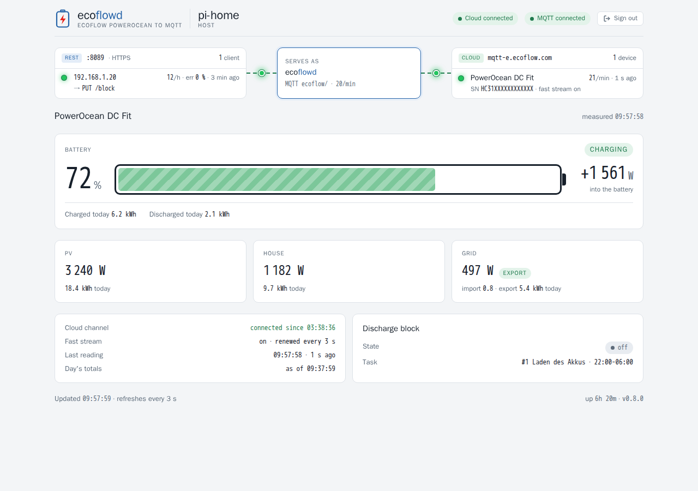
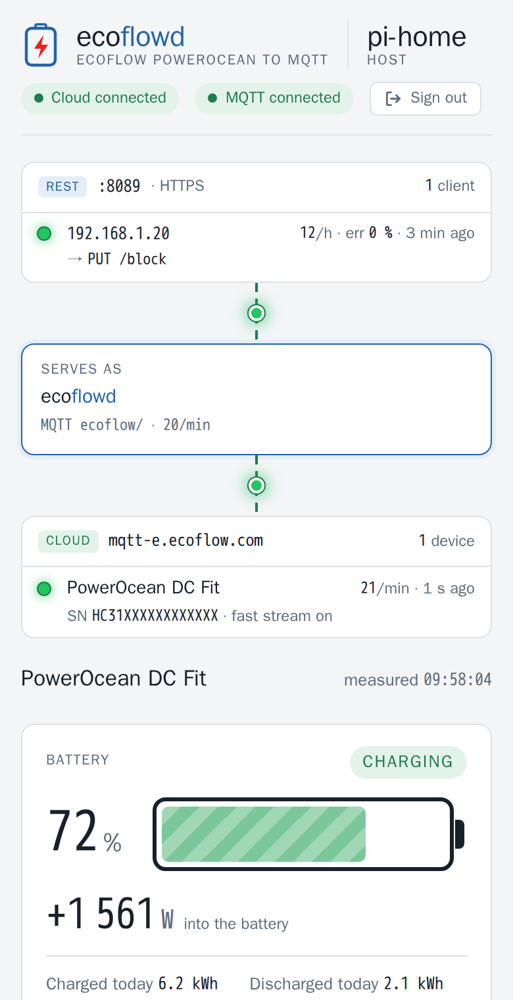
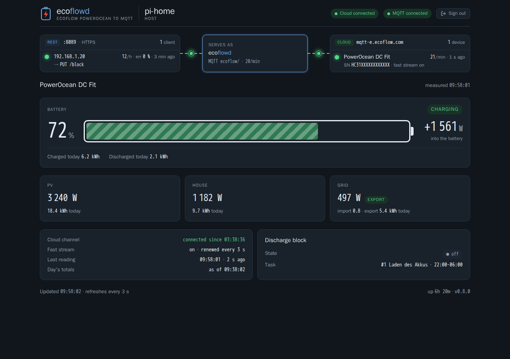
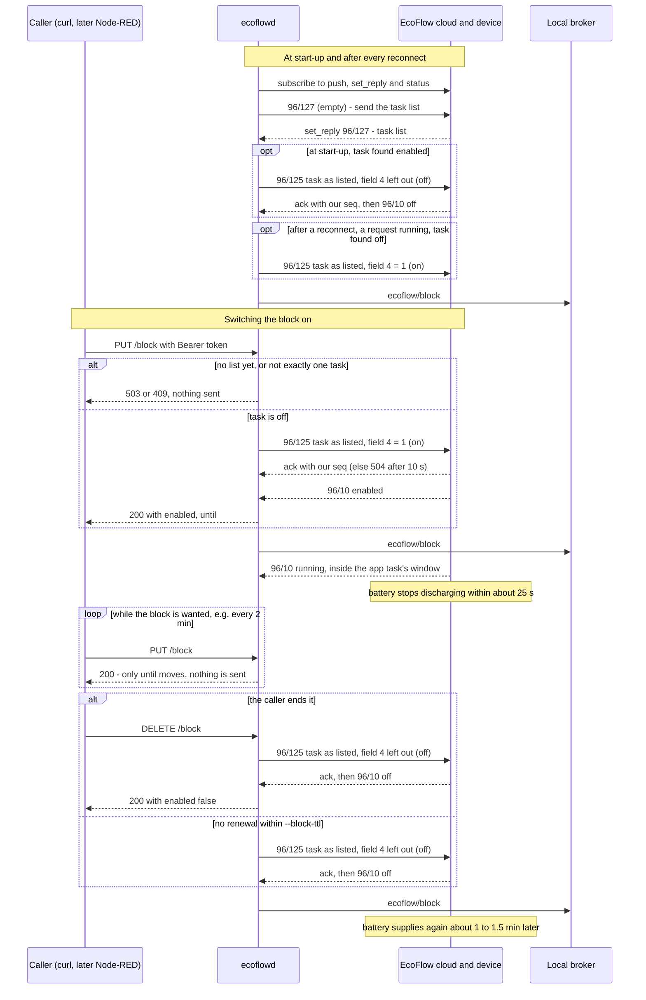
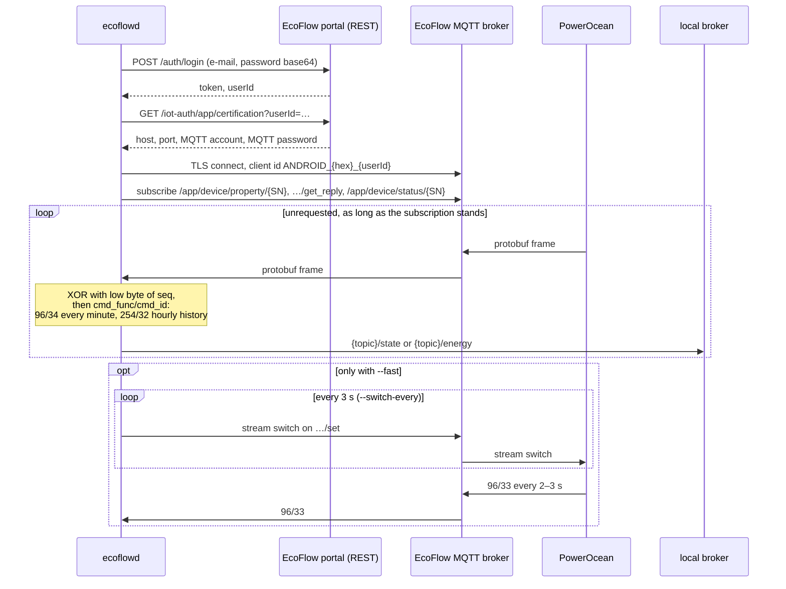

# ecoflowd

**Live readings from an EcoFlow PowerOcean (DC Fit) on your local MQTT broker – for evcc,
Home Assistant, Node-RED or anything else that speaks MQTT.**

[](https://github.com/womat/ecoflow/actions/workflows/ci.yml)
[](https://github.com/womat/ecoflow/releases/latest)
[](LICENSE)
[](go.mod)

🇩🇪 [Deutsche Kurzfassung](README.de.md)

`ecoflowd` logs in the way the EcoFlow app does, subscribes to the device's cloud channel
and publishes what arrives as two JSON telegrams: the current power flows every minute,
and the day's energy totals. Optionally it switches on the per-second stream, and it can
keep the battery from discharging on request, e.g. while the car charges.

- **One static binary or an 11 MB container image**, no state on disk, nothing to install.
- **Read-only by default:** without `--fast` or `--block` it sends nothing to the device.
- **Survives the cloud coming and going:** it reconnects by itself and logs in again only
  when the token is really gone.
- **A web page** with `--listen`: the battery's state of charge and which way it goes, PV,
  house and grid, and how the connections stand. Read-only.

<picture>
  <source media="(prefers-color-scheme: dark)" srcset="docs/screenshots/web-ui-dark.png">
  
</picture>

> **Unofficial.** EcoFlow neither documents nor supports the channel `ecoflowd` uses: the
> login endpoint, the frame layout and the field numbers were all measured, and can stop
> working without notice. How it was established is in the
> [research notes](docs/research/README.md).

## Contents

- [Quick start: Docker](#quick-start-docker)
- [Quick start: systemd](#quick-start-systemd)
- [Configuration](#configuration)
- [MQTT output](#mqtt-output), with [evcc](#evcc) and [Home Assistant](#home-assistant)
- [Per-second values: `--fast`](#per-second-values---fast)
- [Web page: `--listen`](#web-page---listen)
- [Discharge block: `--block`](#discharge-block---block)
- [How ecoflowd gets its data](#how-ecoflowd-gets-its-data)
- [Background and research](#background-and-research)
- [Working on this repo](#working-on-this-repo)

## Quick start: Docker

The image `ghcr.io/womat/ecoflowd` is built with every release for `linux/amd64`,
`linux/arm64`, `linux/arm/v7` and `linux/arm/v6` (every Raspberry Pi). It holds the
binary and the CA certificates, nothing else – no shell, and it runs as a non-root user.

You need [`docker-compose.yaml`](docker-compose.yaml) and
[`.env.example`](.env.example) from this repo:

```bash
mkdir ecoflowd && cd ecoflowd
curl -fsSLO https://raw.githubusercontent.com/womat/ecoflow/main/docker-compose.yaml
curl -fsSL -o .env https://raw.githubusercontent.com/womat/ecoflow/main/.env.example
chmod 600 .env
nano .env            # serial number, EcoFlow e-mail and password, broker
docker compose up -d
docker compose logs -f
```

**`.env` is the EcoFlow account password**, not an application token: the login endpoint
carries it base64-encoded rather than hashed. `chmod 600` is the counterpart to
`/etc/ecoflowd/env` under systemd.

**Where the broker is.** The default, `tcp://host.docker.internal:1883`, is a broker on the
Docker host. On Linux, Mosquitto 2 listens on `localhost` only unless it has a `listener`
of its own, and a container cannot reach that. A broker that runs in a container is
better reached by name: put both on a shared network (`networks:` in the compose file)
and set `ECOFLOWD_BROKER=tcp://mosquitto:1883`.

**Why `restart: on-failure:3`, not `unless-stopped`.** `ecoflowd` never exits on network or
broker trouble – it retries by itself, with a growing pause. It exits only on a
configuration error (`1`) or when the cloud rejects the credentials (`78`), and waiting
fixes neither. With `unless-stopped`, a wrong password would be tried against the login
endpoint every minute, for ever; with `on-failure:3` the container stops after the third
attempt and `docker compose ps` shows `Exited (78)`. Once `.env` is right,
`docker compose up -d` starts it again.

Flags go into `command:` in the compose file, one per line – `--topic`, `--mqtt-user`,
`--fast`, `--block`; see [Configuration](#configuration). Updating:

```bash
docker compose pull && docker compose up -d
```

`latest` follows the newest release; `ECOFLOWD_VERSION=0.8.0` in `.env` pins one.

## Quick start: systemd

Get the archive from the [releases](https://github.com/womat/ecoflow/releases) – Linux
for every Raspberry Pi and PC, macOS and Windows, statically linked, nothing to install.
`linux_arm64` is for a Pi with a 64-bit OS, `linux_armv7` for 32-bit, `linux_armv6` for
the Pi 1 and Zero; the release notes have the full table.

```bash
VERSION=0.8.0    # or the latest, see the releases page
ARCH=linux_arm64

curl -LO "https://github.com/womat/ecoflow/releases/download/v$VERSION/ecoflowd_${VERSION}_$ARCH.tar.gz"
curl -LO "https://github.com/womat/ecoflow/releases/download/v$VERSION/checksums.txt"
sha256sum -c checksums.txt --ignore-missing
tar -xzf "ecoflowd_${VERSION}_$ARCH.tar.gz"
sudo install -m 0755 ecoflowd /usr/local/bin/
```

The unit is in the archive too. It is a template – one instance per device, the serial
number goes after the `@`:

```bash
sudo install -m 0644 contrib/ecoflowd@.service /etc/systemd/system/
sudo install -d -m 0700 /etc/ecoflowd
sudo install -m 0600 /dev/null /etc/ecoflowd/env
sudo nano /etc/ecoflowd/env
sudo systemctl enable --now ecoflowd@HC31XXXXXXXXXXXX
```

`/etc/ecoflowd/env`:

```ini
ECOFLOW_EMAIL=first.last@example.com
ECOFLOW_PASSWORD=…
MQTT_PASSWORD=…
ECOFLOWD_OPTIONS=--broker tcp://127.0.0.1:1883
```

**This file is the account password**, not an application token — `0700` on the
directory and `0600` on the file are therefore not overdone. The login endpoint sends it
base64-encoded rather than hashed; only the TLS channel protects it.

The unit runs under `DynamicUser` with `ProtectSystem=strict` and writes nothing to disk
— the session token lives in the process's memory.

**The binary belongs in `/usr/local/bin`, not in a directory of its own with tight
permissions** such as `/opt/<name>/bin` with `0770 pv:docker`. The dynamic user is
neither the owner nor in the group, it would not get in, and the start would fail with
"Permission denied". The two obvious ways out are deliberately not taken:

- **Adding the service user to the `docker` group** (`SupplementaryGroups=`) — whoever is
  in `docker` is practically root via the Docker socket.
- **`User=pv` instead of `DynamicUser`** — then the process runs under an account that can
  read its own credentials file. As it is, only systemd reads it as root and passes the
  values to the process as environment; the service user has no access to
  `/etc/ecoflowd`.

Exit `78` keeps the unit down (see the [exit codes](#configuration)); any *other* failure restarts
after 30 seconds, a clean stop by signal does not (`Restart=on-failure`).

```bash
systemctl status ecoflowd@HC31XXXXXXXXXXXX
journalctl -fu ecoflowd@HC31XXXXXXXXXXXX
```

## Configuration

| Flag | Meaning |
|---|---|
| `--sn` | serial number of the device (required) |
| `--broker` | local MQTT broker, e.g. `tcp://127.0.0.1:1883` |
| `--topic` | prefix on the local broker, default `ecoflow` |
| `--mqtt-user` | user for the local broker; password via `MQTT_PASSWORD` |
| `--stdout` | also write every reading to stdout |
| `--fast` | switch on the fast stream — **writes**, see below |
| `--switch-every` | repeat rate for it, default 3s; below 1s is rejected |
| `--block` | switch the discharge block task on request — **writes**, see [Discharge block](#discharge-block---block) |
| `--listen` | addresses of the HTTPS server, comma-separated: the [web page](#web-page---listen) and, with `--block`, its endpoint; e.g. `172.17.0.1,192.168.1.10`, or the container's name under Docker; port 8089 if none is given; never `0.0.0.0` |
| `--tls-cert`, `--tls-key` | certificate and key for it |
| `--block-ttl` | how long a block request holds unless renewed, default 5m, 1m to 15m |
| `--block-task` | the task to switch; by default the only one of type "Laden des Akkus" |
| `--host` | different API host; for US accounts `https://api-a.ecoflow.com` |
| `-v` | report every incoming frame |
| `--version` | print the version and exit |

Credentials come exclusively from the environment — `ECOFLOW_EMAIL`, `ECOFLOW_PASSWORD`,
optionally `ECOFLOW_HOST`, `MQTT_PASSWORD` and, with `--listen`, `ECOFLOWD_HTTP_TOKEN`. Never from flags: whatever is on the
command line, anyone on the machine can read in the process list.

Three exit codes, and one of them matters for continuous operation:

| Code | Meaning |
|---|---|
| `0` | stopped on a signal |
| `1` | usage or configuration error |
| `78` | **the credentials were rejected** — waiting never helps here |

There is no code for "gave up after repeated failure": on network and broker errors the
service never gives up, it keeps trying with a growing pause (see
[How ecoflowd gets its data](#how-ecoflowd-gets-its-data)).

The systemd unit lists `78` in `RestartPreventExitStatus`, so that a typo in the
credentials file does not keep firing login attempts at an unofficial endpoint forever;
under Docker, `restart: on-failure:3` does the same job (see
[Quick start: Docker](#quick-start-docker)).

What counts as a rejection is deliberately narrow, because `78` stops the service for
good: only an answer the cloud formed itself that carries a `code` other than `0`. A
request without an answer, an answer that is not JSON, and a `429` or `5xx` are **not** —
those are retried like any other failure.

**The known gap:** EcoFlow documents these codes nowhere. A `code` that means something
other than "wrong password" — a locked account, say — would arrive with `HTTP 200` and
still land on `78`. The service prints the cloud's message verbatim; if e-mail and
password are right, a `systemctl start` or `docker compose up -d` is the way back.

### Running it by hand

```bash
export ECOFLOW_EMAIL='first.last@example.com'
export ECOFLOW_PASSWORD='…'

./ecoflowd --sn HC31XXXXXXXXXXXX --stdout
```

```console
connected to mqtt-e.ecoflow.com:8883, subscribed to 3 topics
10:29:00Z  PV    1511 W | house    480 W | battery    980 W (charging) | grid     52 W (export) | SoC 73 %
10:30:00Z  PV    1544 W | house    618 W | battery    926 W (charging) | grid      0 W (idle) | SoC 74 %
```

The output is **character-for-character identical** to `scripts/ecoflow-frames.py`, so both
can be run side by side and compared; a test holds them together against the same captures.

**Without `--fast` or `--block` it sends nothing to the device.** That is not caution but what the
device needs: the subscription alone keeps it talking, measured over 23 minutes without a
single message sent to the cloud. The readings still go to your local broker — just every
minute instead of every two to three seconds.

## MQTT output

```bash
./ecoflowd --sn HC31XXXXXXXXXXXX --broker tcp://127.0.0.1:1883 --topic myhome/ecoflow
```

**Two JSON telegrams**, neither retained, QoS 0. The topic is `--topic` (default
`ecoflow`) plus a fixed `/state` or `/energy`:

```
myhome/ecoflow/state   {"sn":"HC31XXXXXXXXXXXX","timestamp":"2026-09-22T09:13:16Z","pv":975,"house":-459,"battery":515,"grid":0,"soc":63}
myhome/ecoflow/energy  {"sn":"HC31XXXXXXXXXXXX","timestamp":"2026-09-22T09:13:18Z","pv":3301,"house":3206,"batteryIn":1545,"batteryOut":1562,"gridIn":62,"gridOut":175}
```

The values are decoded from the capture `internal/frames/testdata/fast.txt`.

**`state`** – one telegram per new measurement, every minute without `--fast`, every two
to three seconds with `--fast`:

| Key         | Unit          | Meaning                                           |
|-------------|---------------|---------------------------------------------------|
| `sn`        | –             | serial number of the device                       |
| `timestamp` | RFC 3339, UTC | **the device's time of measurement**, not the send time |
| `pv`        | W             | PV power                                          |
| `house`     | W             | house load, **negative = consumption**            |
| `battery`   | W             | **positive = charging**, negative = discharging   |
| `grid`      | W             | **positive = export**, negative = import          |
| `soc`       | %             | state of charge                                   |

**`energy`** – the day's totals, as soon as the six parts of the hourly history with the
same timestamp are together (without `--fast` roughly every ten minutes):

| Key                          | Unit    | Meaning                                       |
|------------------------------|---------|-----------------------------------------------|
| `sn`, `timestamp`            | –       | as above; `timestamp` of the hourly history   |
| `pv`, `house`                | Wh      | PV yield, house consumption                   |
| `batteryIn`, `batteryOut`    | Wh      | charged, discharged                           |
| `gridIn`, `gridOut`          | Wh      | import, export                                |

**"Today" is the UTC day**, because the device keeps its hours in UTC. In Austria the
totals therefore jump to 0 at 01:00 (CET) or 02:00 (CEST), not at midnight.

Why the format looks like this – the reasoning and the measurements are in
[`docs/mqtt-output.md`](docs/mqtt-output.md):

- **The timestamp is in the telegram**, so a receiver sees the age of every value by the
  device's clock. That replaces heartbeat, availability topic and last will; every consumer
  needs an age check instead: `timeout` in evcc, `expire_after` in Home Assistant.
- **`grid` is 0, not missing:** the device leaves out fields with the value 0 (proto3
  behaviour, inferred, not proven); in every such report the energy balance adds up with
  `grid = 0`.
- **`dcdc` is not published** until its role is clear (see the [open points](docs/research/README.md#open-points)).
- **The serial number is in the payload, not in the topic**, so it survives forwarding;
  several devices each need their own `--topic`. Keep topics lowercase – MQTT is
  case-sensitive, and a subscription with one wrong letter gets nothing, not an error.
  `ecoflowd` takes `--topic` unchanged.
- **Keys in camelCase**, the style of the common JSON guidelines.
- **Nothing is retained:** a retained reading outlives what it describes, and Home
  Assistant warns that retained values clash with `expire_after`. A new subscriber waits
  for the next measurement – without `--fast` at most a minute.

With `--mqtt-user` and `MQTT_PASSWORD` for a broker that requires authentication. The
password comes from the environment, because a flag would show up in the process list.

### Moving from v0.4.x

Up to v0.4.x, `ecoflowd` published one topic per value
(`ecoflow/<SN>/pv`, …, `/energy/…`) and a retained `ecoflow/<SN>/status`. All of that is
gone without replacement as of v0.5.0. The old retained `status` stays on the broker until
you delete it:

```bash
mosquitto_pub -h <broker> -r -n -t ecoflow/HC31XXXXXXXXXXXX/status
```

### evcc

The signs stay as the device measures them — converting is left to the human, the same
rule as for the register addresses in [modbusread](https://github.com/womat/modbusread). evcc expects the opposite and has `scale` for
it; `jq` pulls the value out of the telegram:

```yaml
meters:
  - name: pv
    type: custom
    power:
      source: mqtt
      topic: ecoflow/state
      jq: .pv
      timeout: 180s          # without timeout every value counts as current forever
  - name: grid
    type: custom
    power:
      source: mqtt
      topic: ecoflow/state
      jq: .grid
      scale: -1              # device: positive = export, evcc: positive = import
      timeout: 180s
  - name: battery
    type: custom
    power:
      source: mqtt
      topic: ecoflow/state
      jq: .battery
      scale: -1              # device: positive = charging, evcc: positive = discharging
      timeout: 180s
    soc:
      source: mqtt
      topic: ecoflow/state
      jq: .soc
      timeout: 180s
```

`timeout` is not optional: without it, evcc by its own documentation accepts "values of
any age" — a frozen value would then silently keep being used.

For energy values from `ecoflow/energy`, add `scale: 0.001`, because evcc expects kWh and
the values here are Wh.

### Home Assistant

```yaml
mqtt:
  sensor:
    - name: "PV"
      state_topic: "ecoflow/state"
      value_template: "{{ value_json.pv }}"
      unit_of_measurement: "W"
      device_class: power
      state_class: measurement
      expire_after: 180
```

`expire_after` replaces the earlier `availability_topic`: if no telegram comes for three
minutes, the sensor becomes `unavailable`.

## Per-second values: `--fast`

```bash
./ecoflowd --sn HC31XXXXXXXXXXXX --stdout --fast
```

Sends the stream switch every `--switch-every` seconds (default 3) and delivers values
every two to three seconds instead of every minute.

**This is one of the program's two write paths** (the other is [`--block`](#discharge-block---block)),
on the `.../set` topic through which the device could also be reconfigured – hence a flag,
not a default. It sends the same captured,
parameterless switch as `ecoflow-api.sh fast` ([see there](docs/research/tools.md#fast-rate-fast)), with the same 3-second rate;
at ten seconds the device falls back to the minute rate.

If the fast stream still does not come, the service says so **once**, after about 60 s,
and carries on at the minute rate. The broker accepts the switch in any case (`PUBACK RC:0` measured); whether
it works is shown only by whether fast reports arrive.

## Web page: `--listen`

With `--listen`, `ecoflowd` serves a page that shows what it reads – in the browser, on the
phone, without a broker or a dashboard in between:

- **The battery first:** state of charge, a cell that fills (light green, dark green when
  full, yellow below 20 %), stripes that run in while it charges and out while it
  discharges, the power, and what went in and out today.
- **PV, house and grid** with today's energy, the grid as import or export.
- **The connections** as a strip from left to right: who asked for the block, `ecoflowd`,
  the EcoFlow cloud and the device behind it, with a LED that flashes per report; the local
  broker as a pill in the header.
- With `--block`, the **block's state** – on or off, until when, renewed by whom.

**It is read-only.** The page shows the block but cannot switch it: a switch there would be
another way to write to the device, see [Discharge block](#discharge-block---block).

```bash
export ECOFLOWD_HTTP_TOKEN="$(openssl rand -hex 32)"
./ecoflowd --sn HC31XXXXXXXXXXXX --broker tcp://127.0.0.1:1883 \
           --listen 192.168.1.10 --tls-cert tls.crt --tls-key tls.key
```

Then open `https://192.168.1.10:8089/` and enter the token once; the browser keeps it until
"Sign out". The page itself holds no data and needs no token, everything it shows comes
from `/status`, which does:

| Request | Answer |
|---|---|
| `GET /` | the page, self-contained – no external fonts or scripts |
| `GET /status` | what the page shows, as JSON; needs `Authorization: Bearer <token>` |
| `PUT`, `DELETE`, `GET /block` | only with `--block`, see below |

**Where to listen:** on the addresses you name, never on every interface – `0.0.0.0` is
refused. For the page that is the machine's LAN address, and it should be one the router
always hands out the same (in a Fritz!Box: "IPv4-Adresse dauerhaft zuweisen") – if it
changes, binding fails at the next start. Several addresses go comma-separated: with a
caller of `--block` in a container, `--listen 172.17.0.1,192.168.1.10` keeps it on the
Docker bridge and puts the page on the LAN; `/block` is then on the LAN too, protected by
the token and TLS. The certificate has to name every address and the name you type in the
browser:

```bash
openssl req -x509 -newkey rsa:3072 -nodes -days 3650 -subj "/CN=ecoflowd" \
  -addext "subjectAltName=IP:172.17.0.1,IP:192.168.1.10,DNS:mysmarthome.fritz.box" \
  -keyout /etc/ecoflowd/tls.key -out /etc/ecoflowd/tls.crt
```

The browser warns once about a self-signed certificate, or you import `tls.crt` as trusted.
A caller of `/block` that checks the certificate – Node-RED's `tls-config` – needs the new
file as well. With ufw, the port has to be allowed from the LAN:
`sudo ufw allow from 192.168.1.0/24 to any port 8089 proto tcp`.

Under Docker, `--listen` takes the container's name and the port is published on one host
address only: `ports: ["192.168.1.10:8089:8089"]`, commented out in
[`docker-compose.yaml`](docker-compose.yaml), together with `hostname:` so the page shows
the machine's name rather than the container's id.

<p>
  
  
</p>

## Discharge block: `--block`

Keeps the battery from discharging on request, e.g. while the car charges. It uses a
scheduled task of the app: the mode **"Laden des Akkus"** (charge battery) stops the battery
discharging, PV goes to the loads, the grid covers the rest, and surplus PV still charges
the battery. Enabled from outside the app, such a task takes effect about 25 s later, and
within a good minute of disabling it the battery supplies again – measured in the fifth
write test, see [`api-status.md`](docs/research/api-status.md), section 3.

**How it is split up:**

- **In the app**, set up exactly **one** task of type "Laden des Akkus". Its window and
  repetition decide *when* a block may apply at all, e.g. daily 00:00–24:00. The app
  refuses a second task whose window overlaps, even while the first is disabled.
- **`ecoflowd`** only switches that task on and off. It never changes the times, creates
  or deletes anything. It finds the task by itself: exactly one of type 1, or the one
  named with `--block-task`. With none or several it switches nothing and answers `409`.
- **The caller** (the home automation, for now `curl`) decides *whether*: it asks over
  HTTPS and renews the request while the block is wanted.

```bash
export ECOFLOWD_HTTP_TOKEN="$(openssl rand -hex 32)"
./ecoflowd --sn HC31XXXXXXXXXXXX --broker tcp://127.0.0.1:1883 --block \
           --listen 172.17.0.1:8089 --tls-cert tls.crt --tls-key tls.key
```

| Request | Effect |
|---|---|
| `PUT /block` | switch on, or renew; holds for `--block-ttl` (default 5 min) |
| `DELETE /block` | switch off now |
| `GET /block` | the state |

Every request carries `Authorization: Bearer <token>`. The answer is the state as JSON,
the same as the [`<topic>/block` telegram](docs/mqtt-output.md):

```json
{"sn":"HC31XXXXXXXXXXXX","timestamp":"2026-10-03T12:00:01Z","task":7,"requested":true,
 "until":"2026-10-03T12:05:00Z","enabled":true,"running":true,"window":"00:00-24:00"}
```

`enabled` and `running` are the device's, from its task list; `running` is false outside
the app task's window even when the task is enabled. Right after a switch `running` can
lag by about a second – the answer shows the device's list at that moment. Status codes: `200`, `401` wrong or
missing token, `409` not exactly one task to switch, `503` no connection to the device or
no task list yet, `504` the device did not acknowledge within 10 s.

```bash
curl --cacert tls.crt -H "Authorization: Bearer $ECOFLOWD_HTTP_TOKEN" \
     -X PUT https://172.17.0.1:8089/block
```

**How a request travels** – from the caller through `ecoflowd` to the device and back, with
the telegram to the local broker:


```mermaid
sequenceDiagram
    participant C as Caller (curl, later Node-RED)
    participant E as ecoflowd
    participant D as EcoFlow cloud and device
    participant B as Local broker

    Note over E,D: At start-up and after every reconnect
    E->>D: subscribe to push, set_reply and status
    E->>D: 96/127 (empty) - send the task list
    D-->>E: set_reply 96/127 - task list
    opt at start-up, task found enabled
        E->>D: 96/125 task as listed, field 4 left out (off)
        D-->>E: ack with our seq, then 96/10 off
    end
    opt after a reconnect, a request running, task found off
        E->>D: 96/125 task as listed, field 4 = 1 (on)
    end
    E->>B: ecoflow/block

    Note over C,D: Switching the block on
    C->>E: PUT /block with Bearer token
    alt no list yet, or not exactly one task
        E-->>C: 503 or 409, nothing sent
    else task is off
        E->>D: 96/125 task as listed, field 4 = 1 (on)
        D-->>E: ack with our seq (else 504 after 10 s)
        D-->>E: 96/10 enabled
        E-->>C: 200 with enabled, until
    end
    E->>B: ecoflow/block
    D-->>E: 96/10 running, inside the app task's window
    Note over D: battery stops discharging within about 25 s

    loop while the block is wanted, e.g. every 2 min
        C->>E: PUT /block
        E-->>C: 200 - only until moves, nothing is sent
    end

    alt the caller ends it
        C->>E: DELETE /block
        E->>D: 96/125 task as listed, field 4 left out (off)
        D-->>E: ack, then 96/10 off
        E-->>C: 200 with enabled false
    else no renewal within --block-ttl
        E->>D: 96/125 task as listed, field 4 left out (off)
        D-->>E: ack, then 96/10 off
    end
    E->>B: ecoflow/block
    Note over D: battery supplies again about 1 to 1.5 min later
```

**What it does on its own:**

- A request **not renewed** within `--block-ttl` ends, and the task is switched off. A
  caller that asks every two minutes with the default of five keeps the block through a
  missed request.
- **At start-up** an enabled task is switched off – a restart leaves no block behind.
- A request **survives a reconnect** to the cloud; afterwards the task is brought back
  on if needed.
- **Switching in the app stands.** `ecoflowd` acts on a request, its end and at start-up,
  and does not keep correcting the device. So the block can still be set by hand.

**What it cannot do:** the fallback runs in `ecoflowd`, not on the device. If `ecoflowd`
or the cloud is down, an enabled task stays enabled until the end of its window or a
restart – a tariff disadvantage, no harm.

**What it sends**, both on `.../set` and both captured from the app: the request for the
task list (`96/127`, no payload) once per connection, and the task itself (`96/125`),
exactly as the device listed it, with only its on/off field changed. A test checks that
this reproduces the app's own command byte for byte. The answers come on `.../set_reply`,
which is subscribed to only with `--block`.

**Certificate and token.** The endpoint speaks TLS 1.3 only, and the certificate has to
name the address the caller connects to. A self-signed one is enough, the caller trusts
exactly this certificate. RSA rather than an EC key on purpose: LibreSSL (macOS) writes EC
keys with explicit curve parameters, which Go refuses.

```bash
openssl req -x509 -newkey rsa:3072 -nodes -days 3650 \
  -subj "/CN=ecoflowd" -addext "subjectAltName=IP:172.17.0.1" \
  -keyout /etc/ecoflowd/tls.key -out /etc/ecoflowd/tls.crt
chmod 600 /etc/ecoflowd/tls.key
openssl rand -hex 32   # into /etc/ecoflowd/env as ECOFLOWD_HTTP_TOKEN=...
```

Under systemd the unit hands both files over with `LoadCredential=`, see
[`contrib/ecoflowd@.service`](contrib/ecoflowd@.service).

**Where to listen:** on the Docker bridge (`172.17.0.1` by default) when the caller runs
in a container, otherwise on `127.0.0.1` – and the LAN address next to it, if the
[web page](#web-page---listen) should be reachable there too: `--listen 172.17.0.1,192.168.1.10`.
An address is required and `0.0.0.0` is refused. **A host firewall has to let the bridge in:**
with ufw's default "deny incoming", a container's request times out while one from the host
itself works. Allow the port on the bridge only, not from everywhere:

```bash
sudo ufw allow in on docker0 to 172.17.0.1 port 8089 proto tcp comment 'ecoflowd --block'
```

`/etc/ecoflowd` is readable by root alone, so a `curl --cacert /etc/ecoflowd/tls.crt` on the
host has to run with `sudo`. The caller in the container gets a copy of `tls.crt`; it is
the certificate, not the key, and need not be secret. Whether TLS is needed at all inside one
machine was weighed: the traffic does not leave it. TLS was chosen anyway (3 Oct 2026),
mainly so that the token never crosses a wire in clear, should the setup ever change.

**Under Docker** it is simpler: `ecoflowd` and its caller share a network, and the
endpoint listens on the container's own name, which resolves to its address on that
network – `--listen=ecoflowd:8089`. Containers on the network reach it as
`https://ecoflowd:8089/block`, nothing else does; without a `ports:` entry there is no bridge
address to look up and no firewall rule. Publishing the port for the web page puts
`/block` on that host address as well. The certificate names the container instead of
an IP, and the key has to be readable by the image's user, `65532`:

```bash
openssl req -x509 -newkey rsa:3072 -nodes -days 3650 \
  -subj "/CN=ecoflowd" -addext "subjectAltName=DNS:ecoflowd" \
  -keyout tls.key -out tls.crt
sudo chown 65532 tls.key && sudo chmod 400 tls.key
```

The compose file has the flags, the `secrets:` for both files and the shared network
commented out, ready to switch on; `ECOFLOWD_HTTP_TOKEN` goes into `.env`.

## How ecoflowd gets its data

Not through the Developer API — that one refuses the PowerOcean with error 1006, see
[`api-status.md`](docs/research/api-status.md) —, but the way the app does it: two REST calls to get in,
then an MQTT subscription over which the device delivers on its own.


```mermaid
sequenceDiagram
    participant D as ecoflowd
    participant P as EcoFlow portal (REST)
    participant B as EcoFlow MQTT broker
    participant G as PowerOcean
    participant L as local broker

    D->>P: POST /auth/login (e-mail, password base64)
    P-->>D: token, userId
    D->>P: GET /iot-auth/app/certification?userId=…
    P-->>D: host, port, MQTT account, MQTT password
    D->>B: TLS connect, client id ANDROID_{hex}_{userId}
    D->>B: subscribe /app/device/property/{SN}, …/get_reply, /app/device/status/{SN}
    loop unrequested, as long as the subscription stands
        G->>B: protobuf frame
        B->>D: protobuf frame
        Note over D: XOR with low byte of seq,<br/>then cmd_func/cmd_id:<br/>96/34 every minute, 254/32 hourly history
        D->>L: {topic}/state or {topic}/energy
    end
    opt only with --fast
        loop every 3 s (--switch-every)
            D->>B: stream switch on …/set
            B->>G: stream switch
        end
        G->>B: 96/33 every 2–3 s
        B->>D: 96/33
    end
```

When something goes wrong, the service tells three cases apart — by whether waiting helps:

- **Connection gone** (network, broker, timeout): it waits and starts over at the
  certification. The wait starts at 5 s and doubles up to at most 15 min; if the
  connection stood in between, it starts at 5 s again. The token is kept, so there is no
  new login – that matters, because the login is the one request that carries the account
  password. A timeout or an HTML error page from the gateway says nothing about the token. The client id is new on every attempt, because the broker refuses one it has
  already seen — which is also why paho does not reconnect on its own.
- **Token rejected** (`401`/`403` or a `code` other than `0` on the certification): the
  token is discarded, the next attempt starts with a login. The token is never written to
  disk: that would save one login per restart and be one more copy of a credential.
- **Credentials rejected**: exit `78`, see above — no restart by systemd.

In the code: the flow in [`cmd/ecoflowd/serve.go`](cmd/ecoflowd/serve.go), login,
certification and topics in [`internal/ecoflow/`](internal/ecoflow/), unpacking the frames
in [`internal/frames/frame.go`](internal/frames/frame.go).

## Background and research

`ecoflowd` is where the work in this repo ended up; the way there is documented
alongside. Four ways into the PowerOcean DC Fit were examined – the EcoFlow Developer API,
the consumer portal, the app's MQTT channel and local Modbus TCP – and exactly one
delivers readings continuously today: the app channel `ecoflowd` uses.

| | |
|---|---|
| [`docs/research/`](docs/research/README.md) | Overview, summary of the findings, open points and sources |
| [`docs/research/api-status.md`](docs/research/api-status.md) | The four paths compared, error 1006, the frames, the write tests |
| [`docs/research/modbus-registers.md`](docs/research/modbus-registers.md) | Register map for local Modbus TCP, should the installer ever unlock it |
| [`docs/research/tools.md`](docs/research/tools.md) | [`scripts/ecoflow-api.sh`](scripts/ecoflow-api.sh) and [`scripts/ecoflow-frames.py`](scripts/ecoflow-frames.py), the measuring tools |
| [`docs/mqtt-output.md`](docs/mqtt-output.md) | Why the output looks the way it does |

The registers are checked with [`modbusread`](https://github.com/womat/modbusread), a
universal Modbus reader that lived here as `cmd/modbusread` up to v0.6.0.

## Working on this repo

Every change – Go code and notes alike – goes through a short-lived feature branch and a PR
to `main`; there is no second long-lived branch. CI runs exactly these checks, so running
them first keeps the PR green:

```bash
make test       # go test -race, the golden files against the python decoder, the script's selftest
make lint       # gofmt, go vet, golangci-lint, govulncheck
make build      # ./ecoflowd for this machine
make image      # the container image for this machine, as ecoflowd:dev
make snapshot   # all release archives into ./dist, without publishing (needs goreleaser)
```

`make help` lists the targets, among them `make golden`, which regenerates the golden
files after a change to either decoder.

- **Docs overlap on purpose.** `README.md`, `docs/mqtt-output.md` and the notes in
  `docs/research/` refer to each other; if a statement changes, carry the other places and
  the open-points lists along. The same goes for the tools: a change to a script or to
  `ecoflowd` carries its README section and `--help` text along – and, for a flag or an
  environment variable, `docker-compose.yaml`, `.env.example` and the systemd unit.
- **Commits:** subject in the imperative, naming the result; below it the *why* – the what
  is in the diff.
- **Merging:** squash. `git branch --merged` then reports such branches as "not merged"
  forever, because the branch's commit never becomes an ancestor of `main`; `gh pr list`
  is the reliable way.
- **Go version:** the `go` line in `go.mod` is a minimum and names only the minor version
  (`go 1.27`); it is raised only when the code needs a newer language or library feature.
  Standard library security fixes come from the toolchain used to build – CI and release
  build with `stable`. `go list -m -u all` checks the dependencies, `govulncheck ./...`
  whether a known vulnerability reaches the code; what sits only in an included module is
  updated too. The image is built with `golang:1.27-alpine` instead, which
  picks up every 1.27.x patch release by itself; dependabot proposes the next minor.
- **Docker:** `docker build -t ecoflowd .` builds the image for the local platform; CI
  builds it on every PR, so a broken `Dockerfile` shows before a release.
- **Web page:** `cmd/ecoflowd/ui/index.html` is embedded in the binary, one self-contained
  file. After a change to it, `docs/screenshots/capture.py` renders the README screenshots
  against a mocked `/status` (the command is in the file, it needs Docker).

**Release:** a tag `vX.Y.Z` on `main`, made with `make release TAG=vX.Y.Z` – it refuses a
dirty tree, another branch, or a `main` that differs from `origin/main`. `release.yml`
checks once more that the tag is on `main`, tests the tagged commit again, and GoReleaser
publishes the archives with a changelog; the version goes in via `-X main.version`. Then
the image goes to `ghcr.io/womat/ecoflowd` as `X.Y.Z`, `X.Y` and `latest`. Never tag
another branch: the release would point at a state that never existed in `main`.

Up to v0.6.0 the archives were named `ecoflowd-v0.6.0-linux-arm64.tar.gz` and held only
the binary; from v0.7.0 on they follow the scheme above and carry the systemd unit,
`README.md` and `LICENSE`.

**Which number** is decided by the *kind* of change, not its size: patch as long as no
behaviour changes (help texts, comments and docs do not, however large the diff – `v0.4.1`
had about 60 corrections and was a patch); minor as soon as a flag, command or topic is
added – and, while the number starts with `0.`, also when one is removed or an output
format changes. That is a break and is stated as such in the release notes, as with
`v0.5.0`.

## License

MIT – see [`LICENSE`](./LICENSE). Note that parts of the register information in
`docs/research/` were taken from MIT-licensed third-party sources; the respective
original links are given in `docs/research/modbus-registers.md`.

### Third-party licenses

The source tree contains no third-party code, but a **compiled binary – and so the
container image – statically links** the modules below. Their terms apply to anyone
distributing that binary, not to the sources here.

| Module                                | License                        |
|---------------------------------------|--------------------------------|
| `github.com/eclipse/paho.mqtt.golang` | **EPL-2.0**, dual with EDL-1.0 |
| `github.com/gorilla/websocket`        | BSD-2-Clause                   |
| `golang.org/x/net`, `golang.org/x/sync` | BSD-3-Clause                 |

All of these are permissive except the Eclipse Paho MQTT client, which is weak copyleft at
file level: if you hand out a built binary or image, the source of the EPL-covered parts
has to remain available (it is, at <https://github.com/eclipse-paho/paho.mqtt.golang>).
Paho is dual-licensed, so the BSD-style EDL-1.0 may be chosen instead. Neither obliges
ecoflowd itself to change its license.
